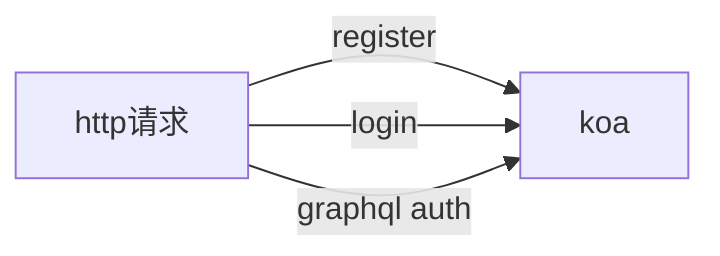

## [认证与授权](https://the-guild.dev/blog/graphql-modules-auth)  

### 认证/授权 Authentication/Authorization
在 [StackOverflow](https://stackoverflow.com/questions/6367865/is-there-a-difference-between-authentication-and-authorization/6367931#6367931) 上我发现一个比较好的答案, 很好地概括了认证和授权的不同

认证与授权有根本的不同, 认证是确定用户的身份, 看起来像是提供这个问题的答案: 
 * 使用者是谁
 * 用户真的是他/她自己吗?    

授权是一种约定机制, 是昔日确定哪个层级的人员可以控制系统.   
 *  X 可以授权访问资源R?
 *  X 可以授权操作资源P?
 *  X 可以授权操作基于P的资源R?

### 认证放在哪里?

### 认证开始(模块化配置)
* 目录结构
>
    |--apollo-server //apollo服务器, 为客户端提供 graphql 查询服务
    |--|--index.js
    |--auth 
    |--|--auth.js // 认证, 认证成功后在 上下文context中返回一个 当前user
    |--graphql // 模式文件夹, schema 在这里定义
    |--|--index.js // 定义的 schema 统一由这个文件导出
    |--|--user.gql
    |--resolvers // 解析器文件夹
    |--|--index.js // 定义的 resolvers 统一由这个文件导出
    |--|--user.resolvers.js
    |--routes // 路由文件夹
    |--|--index.js // 定义的路由统一由这个文件导出
    |--|--userRouter.js 
    |--test
    |--|--测试认证.http
    |--app.js
    |--package.json

* koa 通过中间件向客户端提供如下服务:
>    
    register 注册服务
    login 登录服务
    graphql 服务

    注册, 登录请求是 restful 接口, graphql 请求的接口通过 apollo 服务器处理
    

